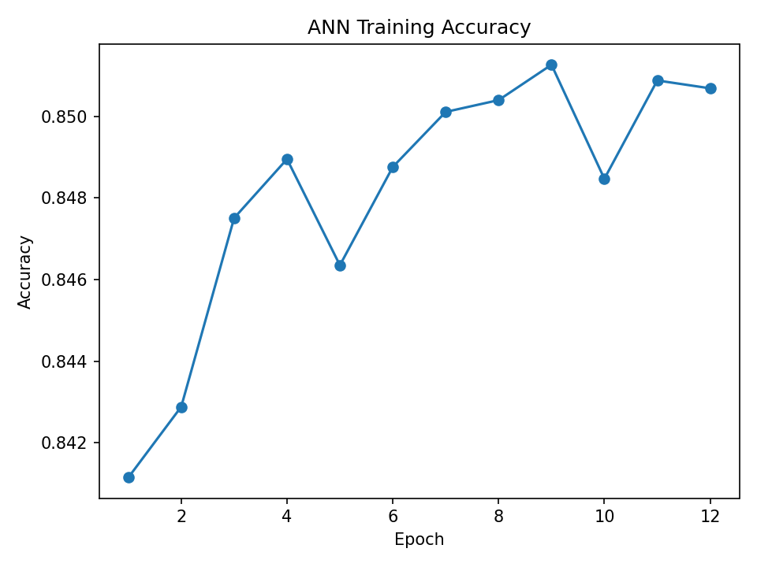
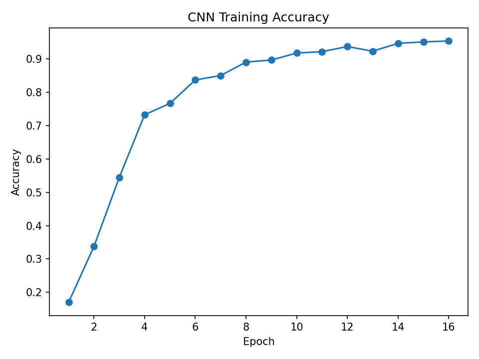
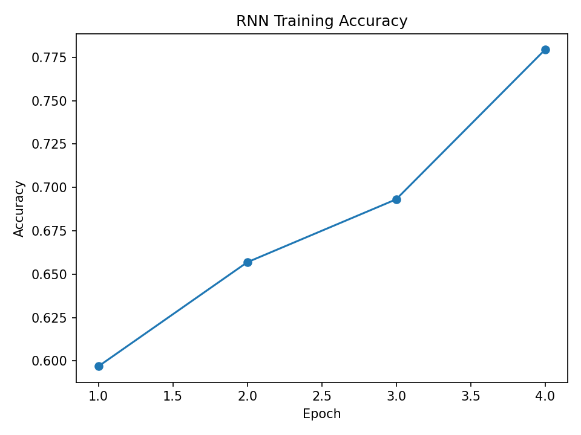
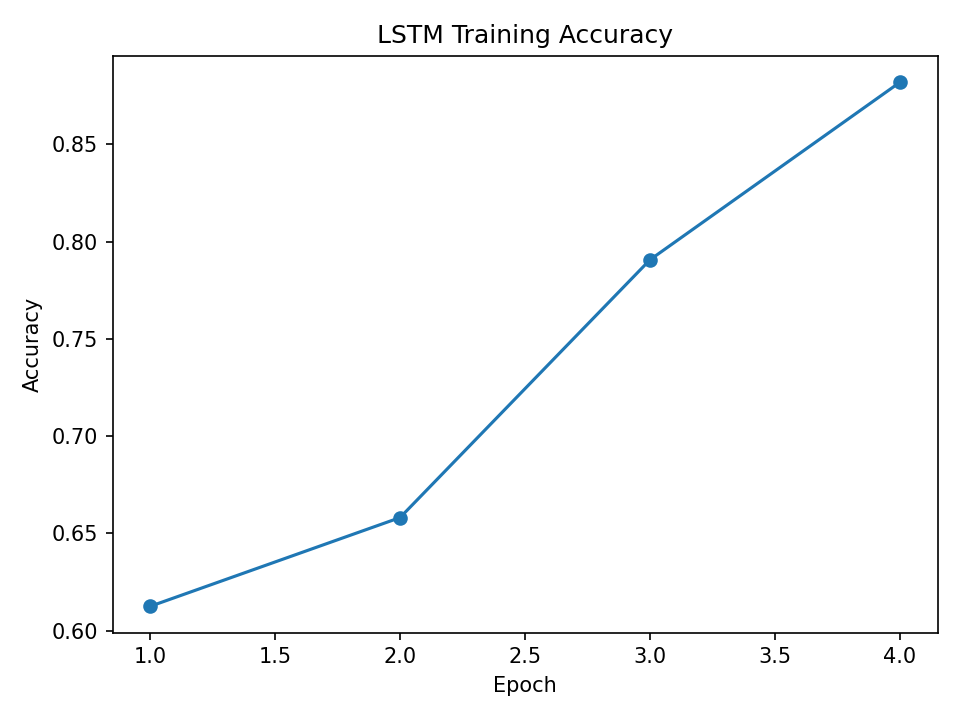
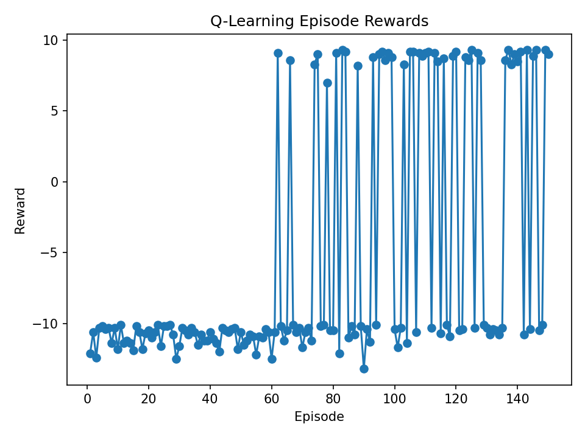
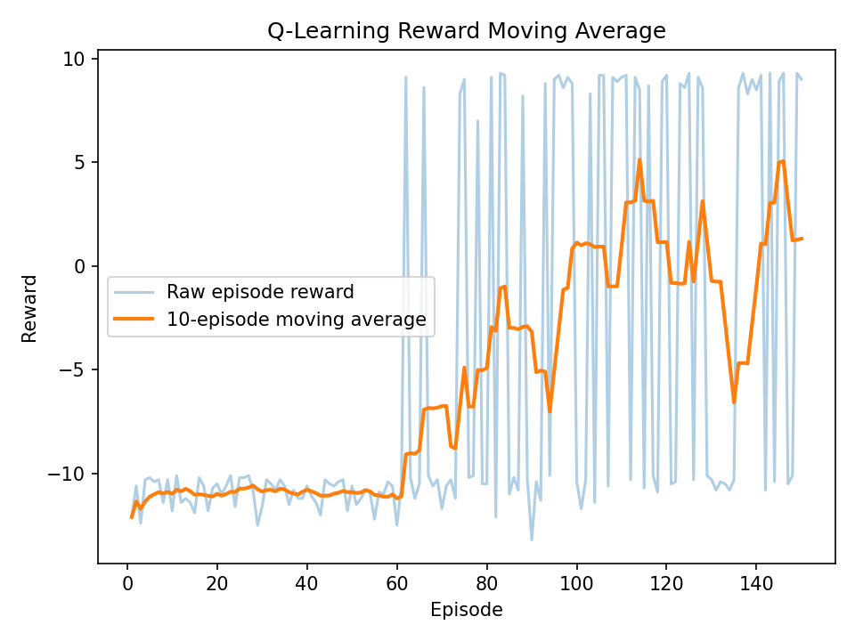

# Deep Learning Suite

A compact set of deep learning experiments covering tabular classification, image classification, text sequence modeling, reinforcement learning, and a few from-scratch NumPy image operations.

I built this project to practice choosing the right model type for different data formats, then measuring the results on held-out test data instead of only looking at training performance.

## What this project does

### ANN / MLP HR classifier

The ANN trains on `data/hrdata3.csv`, a tabular HR dataset. Each row contains numeric employee/job-related features, and the model predicts the `target` column.

- **Trained on:** training split from `hrdata3.csv`
- **Tested on:** held-out rows from the same dataset that the model did not see during training
- **Result:** 85.3% test accuracy
- **Meaning:** the model correctly predicted the target for about 85 out of 100 unseen HR rows

This part shows a standard neural network workflow for structured/tabular data: clean the input columns, standardize numeric features, train an MLP, and evaluate on a test split.

### CNN digits classifier

The CNN trains on the built-in scikit-learn handwritten digits dataset. Each example is a small image of a digit from 0 to 9.

- **Trained on:** training split of digit images
- **Tested on:** held-out digit images
- **Result:** 94.2% test accuracy
- **Meaning:** the CNN correctly classified about 94 out of 100 unseen digit images

This part shows why convolutional layers fit image data well. The model learns local visual patterns such as edges, curves, and digit shapes.

### RNN news classifier

The RNN trains on a balanced subset of `data/news.csv`. Article titles and text are tokenized, converted into integer sequences, and passed through a recurrent network.

- **Trained on:** balanced training subset from `news.csv`
- **Tested on:** held-out news articles
- **Result:** 68.0% test accuracy
- **Meaning:** the basic RNN learned some text patterns, but struggled compared with the LSTM

This part gives a baseline for sequence modeling on text.

### LSTM news classifier

The LSTM uses the same `news.csv` setup as the RNN, but replaces the basic recurrent layer with an LSTM.

- **Trained on:** balanced training subset from `news.csv`
- **Tested on:** held-out news articles
- **Result:** 84.8% test accuracy
- **Meaning:** the LSTM generalized much better than the basic RNN on the same text classification task

This is one of the main comparisons in the project. The LSTM result shows how a stronger sequence model can keep useful context across longer text.

### Q-learning GridWorld

The Q-learning experiment trains an agent in a small GridWorld environment. The agent starts with no useful policy and learns action values through rewards, penalties, epsilon-greedy exploration, and Bellman updates.

- **Trained on:** repeated GridWorld episodes
- **Tested by:** tracking reward over time and the learned policy after training
- **Result:** 1.32 final 10-episode moving average reward
- **Meaning:** the moving average shows whether the agent is improving despite noisy episode rewards

This part shows the basic reinforcement learning loop: state, action, reward, value update, and policy improvement.

### NumPy CNN primitives

This part is not a full trained model. It applies hand-written NumPy image operations to a digit image.

- Laplacian edge detection
- Max pooling
- Convolution-style image processing

This section is included to show the lower-level operations behind CNNs instead of only using PyTorch layers.

## Current results

| Experiment | Test result |
|---|---:|
| ANN / MLP HR classifier | 85.3% accuracy |
| CNN digits classifier | 94.2% accuracy |
| RNN news classifier | 68.0% accuracy |
| LSTM news classifier | 84.8% accuracy |
| Q-learning GridWorld | 1.32 final 10-episode moving average reward |

Full output is saved in [`results/metrics.json`](results/metrics.json).

## Result plots

### ANN / MLP HR classifier



### CNN digits classifier



### RNN news classifier



### LSTM news classifier



### Q-learning episode rewards



### Q-learning moving average



## Data

The project expects these files under `data/`:

```text
data/
├── hrdata3.csv
└── news.csv
```

The included `data/datasets.zip` archive contains those files. The loaders extract the archive automatically if the raw files are missing.

The CNN experiment uses the built-in scikit-learn digits dataset, so no image files are needed.

## Project structure

```text
Deep_Learning_Suite/
├── data/
│   ├── README.md
│   └── datasets.zip
├── results/
│   ├── ann_training_accuracy.png
│   ├── cnn_training_accuracy.png
│   ├── rnn_training_accuracy.png
│   ├── lstm_training_accuracy.png
│   ├── q_learning_rewards.png
│   ├── q_learning_moving_average.png
│   └── metrics.json
├── scripts/
│   └── run_all_experiments.py
├── src/
│   ├── data/
│   ├── deep_learning/
│   ├── rl/
│   └── utils/
├── tests/
├── requirements.txt
└── README.md
```

## Setup

```bash
python -m venv .venv
source .venv/bin/activate
pip install -r requirements.txt
```

On Windows PowerShell:

```powershell
py -m venv .venv
.\.venv\Scripts\Activate.ps1
pip install -r requirements.txt
```

## Run

```bash
python scripts/run_all_experiments.py
pytest
```

The experiment script writes updated plots and metrics to `results/`.

## Resume summary

Built a modular deep learning suite covering ANN tabular classification, CNN image classification, RNN/LSTM text classification, Q-learning, metrics export, plotting, and from-scratch NumPy image operations.
